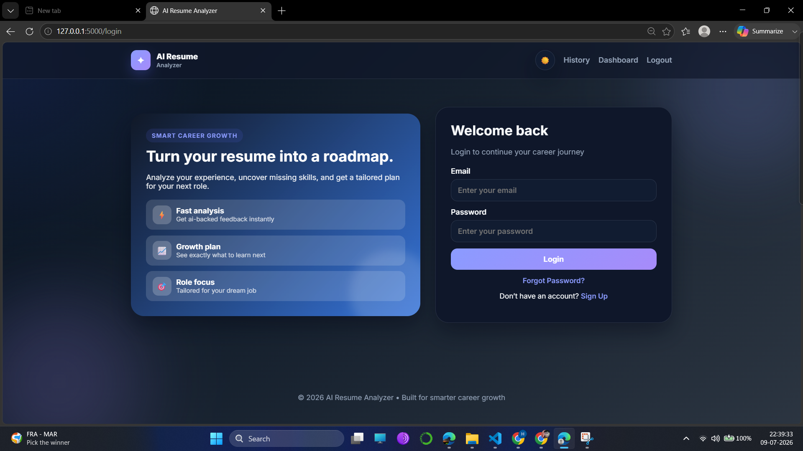
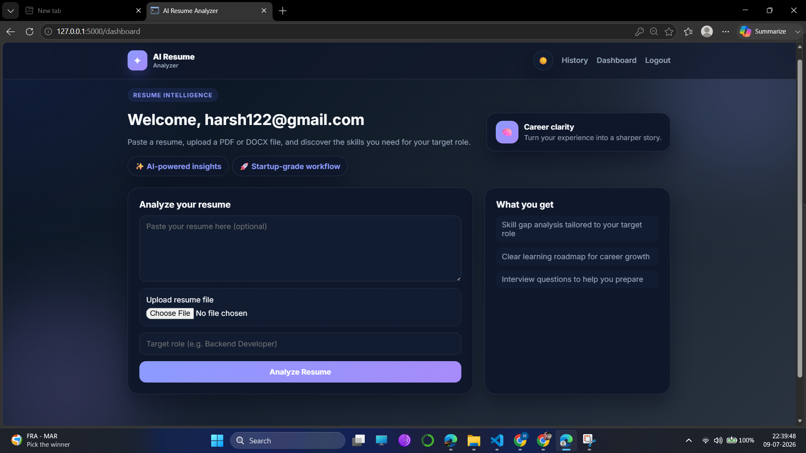
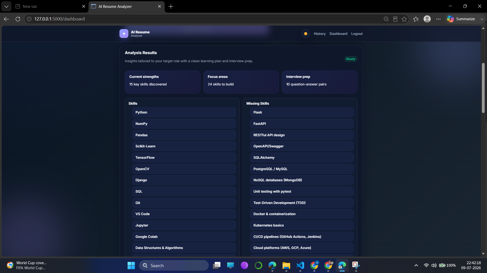
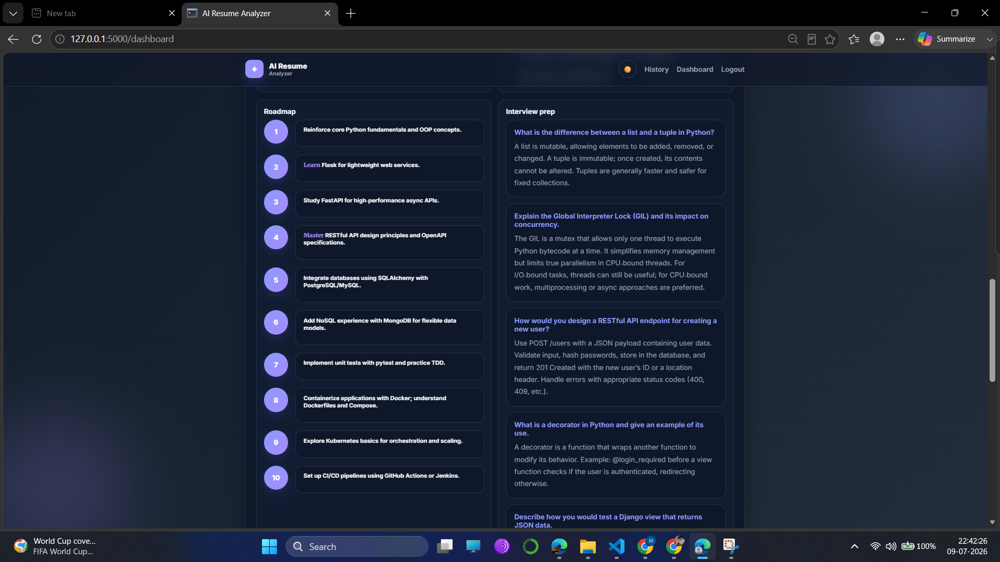
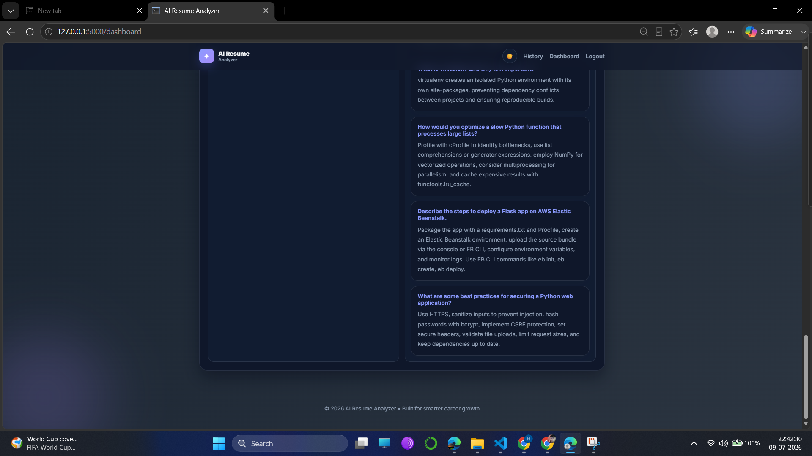

# RESUME-AI-PRO

[](https://www.python.org/)
[](https://flask.palletsprojects.com/)
[](https://opensource.org/license/mit/)

A modern Flask-based AI resume analyzer that helps users understand their current profile, discover missing skills, and receive a tailored roadmap for their next career move.

## ✨ Features
- Resume text input or PDF/DOCX upload
- AI-powered skill gap analysis
- Personalized roadmap suggestions
- Interview question generation
- Premium landing page and dashboard experience

## 📸 Preview
## 📸 Project Screenshots

| Sign Up | Login |
|---------|-------|
|  |  |

| Dashboard |
|-----------|
|  |

| Analysis Results |
|------------------|
|  |

| Learning Roadmap |
|------------------|
|  |

| Interview Preparation |
|------------------------|
|  |

## 🖼️ Project Brand


## 🚀 Getting Started
1. Create and activate a virtual environment
2. Install dependencies:
   ```bash
   pip install -r requirements.txt
   ```
3. Run the app:
   ```bash
   python app.py
   ```
4. Open: http://127.0.0.1:5000

## 🧠 Tech Stack
- Flask
- SQLAlchemy
- Jinja2
- HTML/CSS/JavaScript

## 📁 Project Structure
- app.py — Flask routes and app setup
- templates/ — HTML pages
- static/ — CSS and assets
- models.py / db.py — database models and connection

## 📝 Notes
- The app is designed for resume-based career guidance and skill planning.
- Replace the AI logic in ai.py with your preferred model or API integration.

